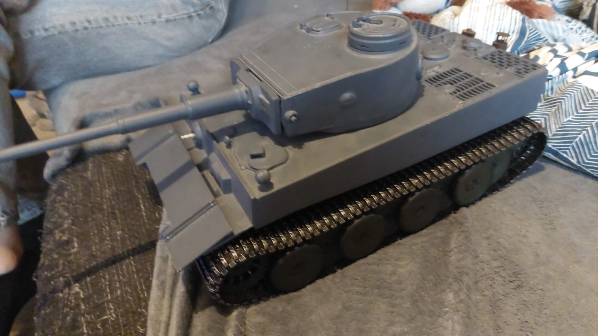

# RC Panzer Webseite

Enthalten:
- `index.html` – Inhalt der Webseite
- `style.css` – komplettes Design
- `script.js` – mobiles Menü und Jahreszahl

## Schnell anpassen

1. Öffne `index.html` in einem Texteditor.
2. Ersetze überall `rcpanzer@example.de` durch deine echte E-Mail-Adresse.
3. Ändere Texte, Modellnamen und Preise nach Wunsch.
4. Die drei großen Platzhalter bei „Meine Panzer“ können später durch echte Bilder ersetzt werden.

## Eigene Fotos einbauen

Lege z. B. ein Foto namens `tiger.jpg` in denselben Ordner.
Dann kannst du in `index.html` einen Platzhalter wie:

```html
<div class="model-image placeholder p2">
  <span>FOTO<br>DEINES TIGERS</span>
</div>
```

durch Folgendes ersetzen:

```html

```

## Veröffentlichen

Die Seite ist eine statische Webseite und kann z. B. bei GitHub Pages, Netlify,
Cloudflare Pages oder auf normalem Webspace hochgeladen werden.

Hinweis: Die verwendete E-Mail-Adresse und alle Preise sind derzeit nur Beispiele.
